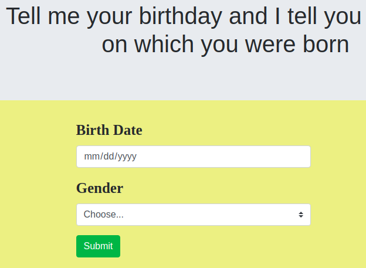

# AKAN GAME

## Project Description

Akan names are derived from Ghanian culture. Frequently in Ghana, children are given their first name as a 'day name' which corresponds to the day in the week they were born. Here are Ghanian day names.

## Author

Niyomufasha Emerance

## Setup Instructions

- Start by reading the information about AKAN game
- Then you click on let's pray

## Technologies used

|   Names              |
|----------------------|
|Javascript            |
|Bootstrap             |

## Contact information

Name: Niyomufasha Emerance
Email: niyemera6@gmail.com
PhoneNumber: +250785297054

copyright &copy; 2019, NiEmerance.All rights reserved